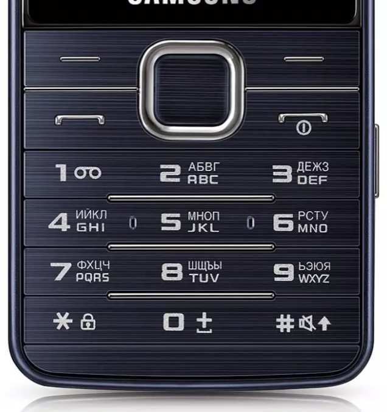

До прихода айфонов-андроидов, в тёмные древние времена, о которых складывают свои легенды старцы, были кнопочные мобильники. Чтобы натыкать на них СМСку, надо было много-много раз нажимать на одни и те же кнопки. Например, чтобы набрать букву «я», которая последняя буква в алфавите, надо было целых четыре раза нажать на девятку. Кнопки у тех, кто активно переписывался, стирались только так :)

Напиши функцию numbers_to_text, которая принимает на вход строку в виде последовательности цифр и пробелов, и переводит эту последовательность в текст кириллицей (абвгд...).  Например, строка  2 означает одинарное нажатие кнопки 2, что соответствует кириллической букве «а». Строка 22 соответствует двойному нажатию на кнопку 2, это буква «б». Строка 222 соответствует тройному нажатию на кнопку 2, это буква «в» и так далее.

Строка 2222 2 222 означает «гав». Пробел между цифрами в коде означает паузу, то есть окончание ввода конкретной буквы.

Полный набор команд приведён ниже:

| Цифра | символы        |
|-------|----------------|
| 1     | . , ? ! : ;    |
| 2     | а б в г        |
| 3     | д е ж з        |
| 4     | и й к л        |
| 5     | м н о п        |
| 6     | р с т у        |
| 7     | ф х ц ч        |
| 8     | ш щ ъ ы        |
| 9     | ь э ю я        |
| 0     | символ пробела |

Регистр текста — всегда нижний.

Если набор цифр некорректный (например, на вход переданы без пробела 123 или 9999999), функция возвращает None, в противном случае функция возвращает текстовый результат. Функция ничего не печатает.
Код пишите в [этом модуле](./decode/decode.py)

Также вам необходимо реализовать функцию, которая будет наоборот, преобразовывать переданный текст в цифры. То есть строка "привет, любимая!" должна быть преобразована к строке вида "5555 6 4 222 33 666 11 0 4444 999 22 4 5 2 9999 1111".
Код пишите в [этом модуле](./encode/encode.py)